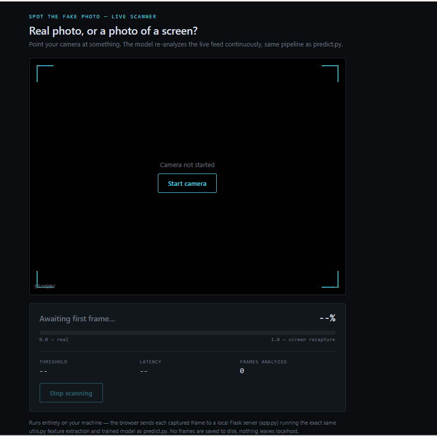

# Spot the Fake Photo — Screen Recapture Detector

Given a single image, predicts whether it's a **real photo (0)** or a **photo of a screen/printout showing another image (1)** — i.e. a "screen recapture."

---

## GitHub Repository

**Repository:**  
https://github.com/MANYAGOEL123/spot-the-fake-photo

---

## Live Demo

A live webcam demo is available where the application continuously predicts whether the camera is viewing a real scene or a screen recapture.

**Live Demo:**  
https://spot-the-fake-photo-xa6t.onrender.com

## Live Demo Preview

The application provides a browser-based interface that continuously analyzes webcam frames using the same prediction pipeline as `predict.py`.

<p align="center">
  
</p>

---

## Example

```bash
python predict.py some_image.jpg
```

Example output:

```
0.93
```

where:

- Values close to **0** indicate a **real photo**.
- Values close to **1** indicate a **screen recapture**.
---

## Approach (short version)

No deep learning, no pretrained vision backbone.

The pipeline extracts **35 handcrafted, physically motivated image features** using OpenCV, scikit-image and SciPy, including:

- Frequency-domain (FFT / Moiré / Aliasing)
- Local Binary Patterns (LBP)
- Wavelet energy
- Noise statistics
- Reflection & glare heuristics
- Sharpness
- Color statistics

The extracted feature vector is used to train multiple machine learning models (Logistic Regression and Random Forest). The best-performing model is automatically selected using cross-validation, probability calibration and validation-set threshold optimization.

See **report.md** for the complete methodology, evaluation metrics, latency and cost-per-image.

### Training-only Data Augmentation

Each training photo contributes four augmented variants:

- Small rotations
- Brightness & contrast jitter
- Crop / Zoom
- Saturation variation
- JPEG recompression

This process is completely leakage-safe.

Augmented copies of an image are grouped using `GroupKFold`, ensuring that different versions of the same image never appear across train, validation and test splits.

Validation and final testing always use only original, unaugmented images.

---

## Performance

**Held-out Test Accuracy:** **84.4%**

Additional evaluation metrics (Precision, Recall, F1-score, ROC-AUC, Confusion Matrix, latency and memory usage) are available in **report.md**.

---

## Setup

### Windows

```bash
python -m venv venv
venv\Scripts\activate
pip install -r requirements.txt
```

### Linux / macOS

```bash
python -m venv venv
source venv/bin/activate
pip install -r requirements.txt
```

---

## Dataset

```
dataset/
├── real/       # 88 photos (label 0)
└── screen/     # 123 photos (label 1)
```

**Dataset Summary**

- Real Photos: **88**
- Screen Recaptures: **123**
- Total Images: **211**

The dataset is entirely self-collected and contains real-world photos together with screen recaptures captured under varying lighting conditions, viewing angles and screen brightness.

It also includes difficult "decoy" cases such as:

- Glass surfaces
- Glossy floors
- Window reflections
- Switched-off monitors
- Different laptop displays

See **report.md** for additional details.

---

## Train

```bash
python train.py
```

Training performs:

- Feature extraction
- Data augmentation
- Group-aware 5-fold Cross Validation
- Hyperparameter search
- Probability calibration
- Decision threshold optimization

The script prints:

- Cross-validation metrics
- Selected best model
- Tuned decision threshold
- Accuracy
- Precision
- Recall
- F1-score
- ROC-AUC
- Confusion Matrix
- Latency
- Memory usage

The trained model is saved as:

```
model/best_model.joblib
```

---

## Predict

```bash
python predict.py path/to/image.jpg
```

Prints one floating-point probability in **[0,1]**.

```
0 = Real Photo
1 = Screen Recapture
```

Logs and errors are written to **stderr**, ensuring stdout always contains only the prediction.

---

## Live Demo (Optional)

```bash
python app.py
```

Then open:

```
http://localhost:5000
```

Allow camera access.

Point the camera at either:

- a real object
- or a screen displaying another image

The interface continuously updates the prediction every ~900 ms.

This is **not a separate implementation**.

`app.py` imports the same `extract_features()` function from `utils.py` and loads the exact same `model/best_model.joblib` used by `predict.py`.

No separate model is used.

No captured frame is written to disk.

---

## Project Structure

```
predict.py               # Required CLI predictor
train.py                 # Training & evaluation pipeline
utils.py                 # Feature extraction
app.py                   # Live demo backend (Flask)
templates/index.html     # Live demo frontend
requirements.txt
README.md
report.md
model/
└── best_model.joblib

dataset/
├── real/
└── screen/
```

---

## Author

**Manya Goel**

GitHub:  
https://github.com/MANYAGOEL123